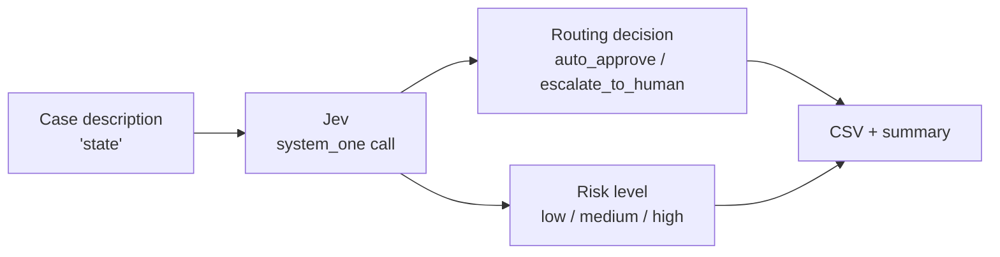

# HumanGate

**Does this need a human?** A small, honest test of a typed decision gate for regulated workflows.

HumanGate checks whether [TypeSafe's Jev](https://typesafe.ai/), a "System One" model that returns typed, structured decisions instead of generated text, can handle the *"auto-approve or escalate to a human?"* gate that sits inside approval workflows in healthcare, insurance, and finance. It sends 15 realistic cases to Jev, records each decision with its confidence, latency, and cost, and saves everything to a CSV you can inspect.

> **Status:** demo / experiment. Not a production compliance tool. See [Limitations](#limitations).

---

## Why this exists

Regulated enterprises put humans in the loop for good reasons, but sending every case to a person is slow and expensive, and asking a full LLM to make every routing decision adds cost, latency, and free-text output that has to be parsed and can drift.

The question this demo asks:

> Can a small model that returns a **constrained, typed answer** (one of a fixed set of choices plus a confidence) do the routing job reliably enough, cheaply enough, and fast enough to be useful?

## How it works



Each case is sent in **one request** with two [Choice](https://docs.typesafe.ai/primitives/choice) questions, evaluated in parallel against the same state:

| Question | Allowed answers | What it captures |
|---|---|---|
| `routing_decision` | `auto_approve`, `escalate_to_human` | The action the gate takes |
| `risk_level` | `low`, `medium`, `high` | How much compliance, financial, or safety exposure the case carries |

The two answers are independent, so they can disagree. A low-risk case can still be escalated, and a **high-risk case marked `auto_approve` is a red flag** worth checking in your results.

## Quick start

### 1. Get an API key

Sign in at **[typesafe.ai](https://typesafe.ai/)** and create an API key.

### 2. Run it

**Google Colab**

1. Click the key icon in the left sidebar, then **Add new secret**.
2. Name it `TYPESAFE_API_KEY`, paste your key as the value, and enable notebook access.
3. Run the cell (`!pip install typesafe-sdk` first if needed).

**Local**

```bash
pip install typesafe-sdk
export TYPESAFE_API_KEY="your-api-key"
python humangate_demo.py
```

The client reads `TYPESAFE_API_KEY` from the environment automatically, as described in the [Quick Start](https://docs.typesafe.ai/introduction/quickstart).

## What you get

A console table as it runs, a summary at the end, and `governance_gate_results.csv`.

**CSV columns**

| Column | Meaning |
|---|---|
| `scenario` | The case text sent to the model |
| `routing_decision` | `auto_approve` or `escalate_to_human` |
| `routing_confidence` | Model's confidence in that choice |
| `risk_level` | `low`, `medium`, or `high` |
| `risk_confidence` | Model's confidence in that label |
| `latency_ms` | Wall-clock time for the request, including network |
| `input_tokens` | Input tokens billed for the request |
| `cost_usd` | Estimated cost from input tokens only |

**Summary block**

```
--- Summary ---
Scenarios run:            <n>
Escalated to human:       <n> / <n>
Avg routing confidence:   <0-1>
Avg latency:              <ms>
Total cost:               $<amount>
Saved: governance_gate_results.csv
```

## The scenarios

The 15 cases are modeled on the approval gates in regulated healthcare, insurance, and finance workflows. They mix easy cases (to check the gate doesn't over-escalate) with clear red flags and a few genuine judgment calls.

The **expected** columns are the author's own predictions of what a sensible gate should say. They are a baseline for comparison, not ground truth.

| # | Scenario | Type | Expected routing | Expected risk |
|---|---|---|---|---|
| 1 | $4,200 out-of-network claim, not on pre-approved list | Judgment | escalate | medium |
| 2 | Drug allergy conflicts with newly prescribed medication | Clear escalate | escalate | high |
| 3 | $85 routine eye exam, on covered list | Clear approve | auto-approve | low |
| 4 | $312 invoice matches PO, approved vendor | Clear approve | auto-approve | low |
| 5 | $58,000 invoice with no matching PO | Clear escalate | escalate | high |
| 6 | $1,900 client dinner, no itemized receipt | Judgment | escalate | medium |
| 7 | Loan income document 14 months old (policy: 12) | Judgment | escalate | medium |
| 8 | $22 refund matching billing system's own error log | Clear approve | auto-approve | low |
| 9 | New vendor from a sanctioned jurisdiction | Clear escalate | escalate | high |
| 10 | Standard refill, no dosage change, prior-auth on file | Clear approve | auto-approve | low |
| 11 | $190,000 hospital claim flagged as statistically unusual | Clear escalate | escalate | high |
| 12 | Change request to auto-approve claims under $50 with no review | Judgment | escalate | medium to high |
| 13 | $4,500 contractor payment matches signed contract | Clear approve | auto-approve | low |
| 14 | New hire requests regulated patient-records access, approval pending | Judgment | escalate | high |
| 15 | Routine PTO request, no conflicts, sufficient balance | Clear approve | auto-approve | low |

**Cases worth a closer look**

- **#7 and #14** can turn on a single phrase, and the right real-world action might be "request more information" or "wait", which a two-option gate can't express.
- **#12** is a request to change the oversight rules themselves, not a claim. It tests whether the model notices what is actually being asked.

## Reading your results

1. **Agreement:** compare each decision to the expected columns. Disagreements on the *clear* cases matter far more than on the judgment calls.
2. **Contradictions:** look for `risk_level = high` with `auto_approve`. That is the failure a compliance team would care about most.
3. **Confidence on judgment calls:** a well-behaved gate should be less sure on #1, #6, #7, #12, and #14. Uniformly high confidence everywhere is a warning sign, since confidence values are not guaranteed to be calibrated.
4. **Latency and cost:** the script gives per-request latency and an input-token cost estimate, useful for comparing against whatever you use today.

## Customizing

- **Your own cases:** edit the `SCENARIOS` list.
- **Different questions:** edit `QUESTIONS`. Each question is a `Choice` with `instructions` and `criteria`, so add, rename, or reword the options. The [docs](https://docs.typesafe.ai/introduction) also describe the Score and Noul primitives, which this demo doesn't use.
- **Different model:** change `MODEL` (currently `jev-latest`).
- **Pricing:** update `INPUT_PRICE_PER_MILLION` to match your dashboard. The value in the script is based on TypeSafe's published rates at the time of writing, and published rates can change, so verify it before quoting numbers externally.

## Limitations

This is a small experiment, and its results should be read that way.

- **Tiny sample:** 15 hand-written cases can show whether the approach is plausible, not how it performs at scale.
- **No ground truth:** the expected labels are one person's judgment. Real reviewers may disagree, especially on the judgment calls.
- **Two-way gate:** real workflows often need more outcomes, such as request more info, wait, or reject.
- **Single-shot cases:** each case is a short description. Real cases involve documents, history, and context that this demo doesn't model.
- **Cost estimate is partial:** it counts input tokens only, using the rate configured in the script.
- **Not compliance advice:** nothing here has been validated against HIPAA, sanctions rules, or any other regulation.

## Data and privacy

All scenarios are synthetic. **Don't send real patient, customer, or financial data** through a demo like this unless you've reviewed the provider's data-handling terms and your own compliance obligations.

## Disclaimer

HumanGate is an independent demo. It is not affiliated with or endorsed by TypeSafe or Opus. Product names are used only to describe what is being tested.

## References

- [TypeSafe: Introduction](https://docs.typesafe.ai/introduction)
- [TypeSafe: Quick Start](https://docs.typesafe.ai/introduction/quickstart)
- [TypeSafe: Choice primitive](https://docs.typesafe.ai/primitives/choice)

## License

MIT
